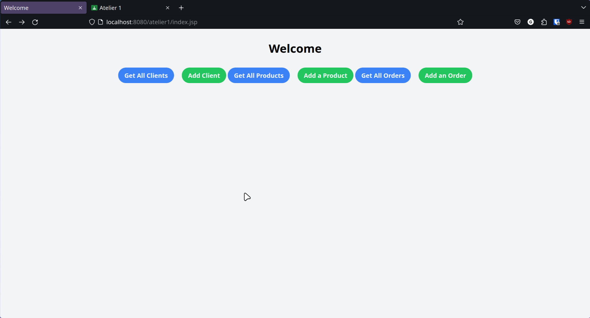
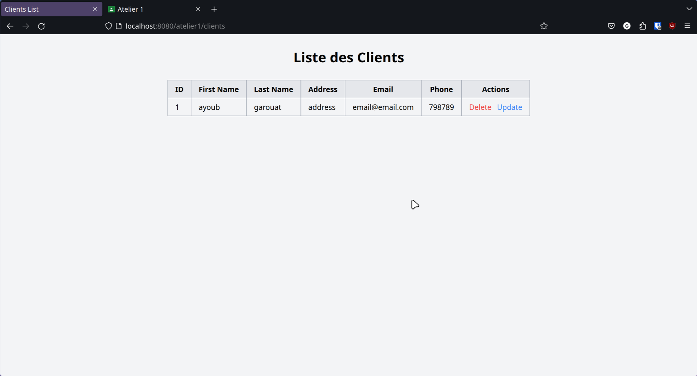
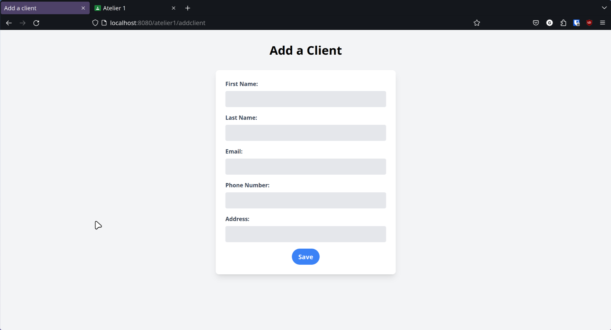
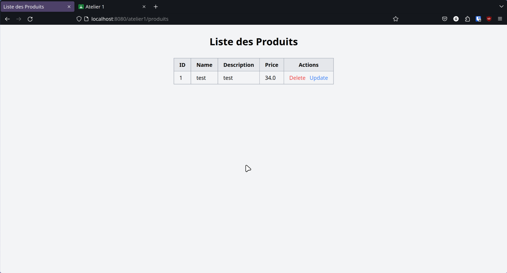
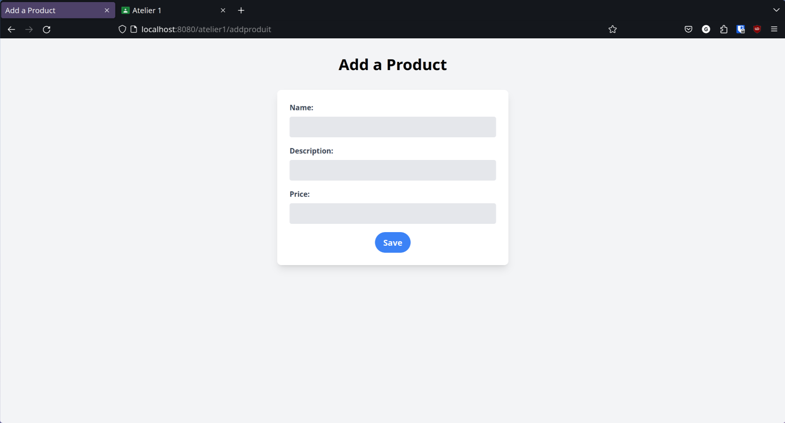
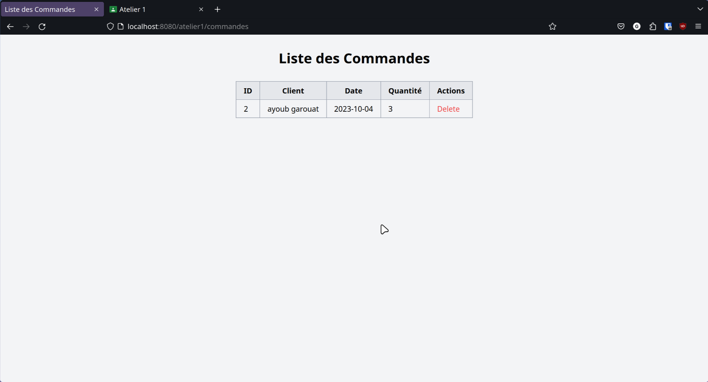

<div align="center" style="margin-top: 20px; margin-bottom: 20px;">
  <h3>Web Application Based on MVC and JEE Standards</h3>

</div>

### Class Diagram

#### Client

- **Attributes:**
  - `id`: Integer
  - `nom`: String
  - `prenom`: String
  - `adresse`: String
  - `email`: String
  - `telephone`: String
- **Methods:**
  - `getId(): Integer`
  - `setId(id: Integer): void`
  - `getNom(): String`
  - `setNom(nom: String): void`
  - `getPrenom(): String`
  - `setPrenom(prenom: String): void`
  - `getAdresse(): String`
  - `setAdresse(adresse: String): void`
  - `getEmail(): String`
  - `setEmail(email: String): void`
  - `getTelephone(): String`
  - `setTelephone(telephone: String): void`

#### Commande

- **Attributes:**
  - `id`: Integer
  - `date`: Date
  - `client`: Client
- **Methods:**
  - `getId(): Integer`
  - `setId(id: Integer): void`
  - `getDate(): Date`
  - `setDate(date: Date): void`
  - `getClient(): Client`
  - `setClient(client: Client): void`

#### Produit

- **Attributes:**
  - `id`: Integer
  - `nom`: String
  - `description`: String
  - `prix`: double
- **Methods:**
  - `getId(): Integer`
  - `setId(id: Integer): void`
  - `getNom(): String`
  - `setNom(nom: String): void`
  - `getDescription(): String`
  - `setDescription(desc: String): void`
  - `getPrix(): double`
  - `setPrix(prix: double): void`

#### LignedeCommande

- **Attributes:**
  - `id`: Integer
  - `quantite`: int
  - `produit`: Produit
  - `commande`: Commande
- **Methods:**
  - `getId(): Integer`
  - `setId(id: Integer): void`
  - `getQuantite(): int`
  - `setQuantite(quantite: int): void`
  - `getProduit(): Produit`
  - `setProduit(produit: Produit): void`
  - `getCommande(): Commande`
  - `setCommande(commande: Commande): void`

#### Relationships

- `Client` has a one-to-many relationship with `Commande`.
- `Commande` has a many-to-one relationship with `Client`.
- `Commande` has a one-to-many relationship with `LignedeCommande`.
- `LignedeCommande` has a many-to-one relationship with `Commande`.
- `LignedeCommande` has a many-to-one relationship with `Produit`.
- `Produit` has a one-to-many relationship with `LignedeCommande`.

### PostgreSQL Database Tables

#### Clients Table

```sql
CREATE TABLE clients (
    id SERIAL PRIMARY KEY,
    nom VARCHAR(255),
    prenom VARCHAR(255),
    adresse VARCHAR(255),
    email VARCHAR(255),
    telephone VARCHAR(255)
);

CREATE TABLE commandes (
    id SERIAL PRIMARY KEY,
    date DATE,
    client_id INT,
    FOREIGN KEY (client_id) REFERENCES clients(id)
);

CREATE TABLE produits (
    id SERIAL PRIMARY KEY,
    nom VARCHAR(255),
    description TEXT,
    prix DOUBLE PRECISION
);

CREATE TABLE lignesdecommande (
    id SERIAL PRIMARY KEY,
    quantite INT,
    produit_id INT,
    commande_id INT,
    FOREIGN KEY (produit_id) REFERENCES produits(id),
    FOREIGN KEY (commande_id) REFERENCES commandes(id)
);

```

## Screens







